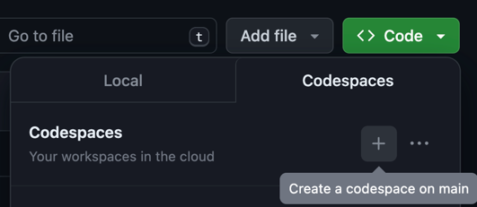
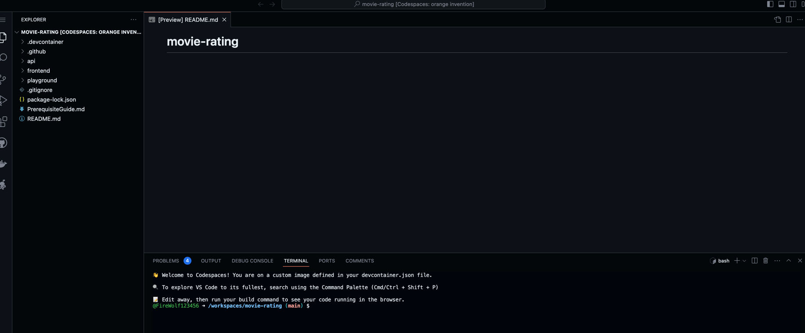
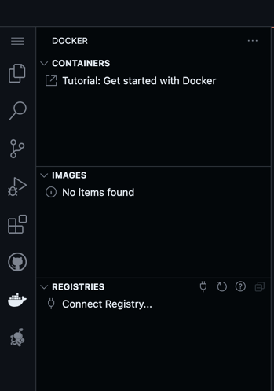
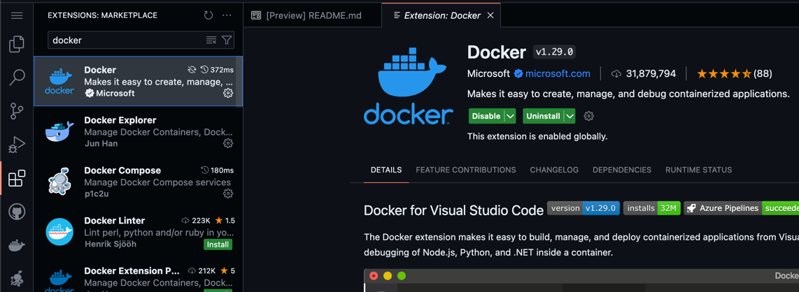

# Movie Rating

If you are looking for running the app locally see PrerequisiteGuide.md

# Running CodeSpace

1. Click `Code` at the top right of the repo
2. Click the `CodeSpace` tab


3. Click `+` to create a codespace on main



4. Observe the cloud workspace starting up. Note: this process should take around 2 minutes


5. Once it is complete you should be able to view the repo



## Start the Go API and React Frontend in the codespace

### Go API
1. Wait for the docker container to start up. You can view Docker on the left of your codespace
   - If you do not see the docker whale, navigate to the boxes on the left and install the docker extension
   
   
   

2. `cd ../playground`
3. your path (`pwd`) should be **{system directories}/interview-pre-req-check/playground**
4. run `./build.sh`
- you may need to either `chmod +x ./build.sh` to make it executable or just run the below commands as an alternative
  ```
    docker-compose down -v --remove-orphans
    docker-compose rm -f -s
    docker-compose up --always-recreate-deps --remove-orphans --renew-anon-volumes --build
    ```
- Postgres db will start
- API will start at localhost:8080
    - note: you may see a "connection refused" until postgres fully stands up
5. Find the Ports tab on the bottom of the codespace next to your Terminal. Use the url found under `Forwarded Port` for 8080 going forward 
   
   

6. Validate api started correctly by navigating to `http://$[8080 Forwarded Port}/api/health` in a browser or run `curl http:///$[8080 Forwarded Port}/api/health` and confirming response body of **{"health":"OK"}**
   
   

### React App
1. Open a new terminal in the repo directory and `cd frontend`
- your path (`pwd`) should be **{system directories}/interview-pre-req-check/frontend**
2. `npm install --location=global react-scripts`
3. `npm install`
4. `npm start`
- React app will start at localhost:3000
  - View the app using the url of `Forwarded Port` for 3030

  

6. Getting the React App to talk to the API
   - Right click the 8080 port and make it public


  - Going forward any React call will need to be to the `Forwarded Port` api for port 8080 
  - Update the api health endpoint in `frontend/src/Health.js` to the api 8080 `Forwarded Port`


  - Validate react app is working properly by seeing it state in terminal it has started and validate it is talking to your api by navigating to `http://$[3030 Forwarded Port}/health` and seeing OK in the browser console logs

Troubleshooting:
- If you encounter any issues with `npm install`, try deleting the node_module directory and package-lock.json file in /frontend and running the commands again.


